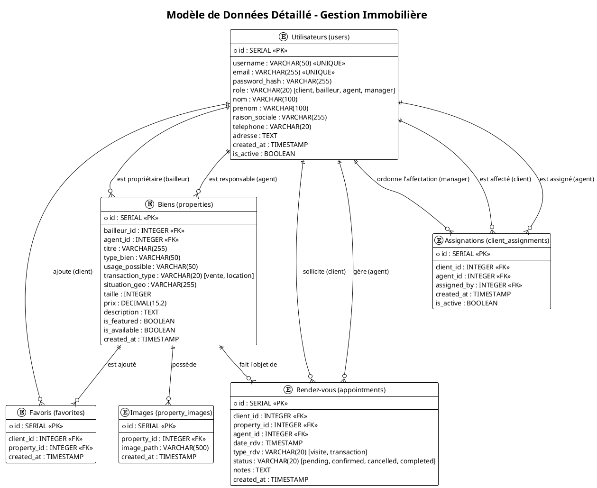
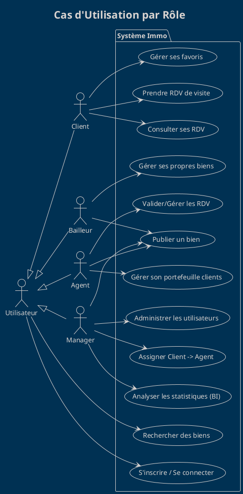
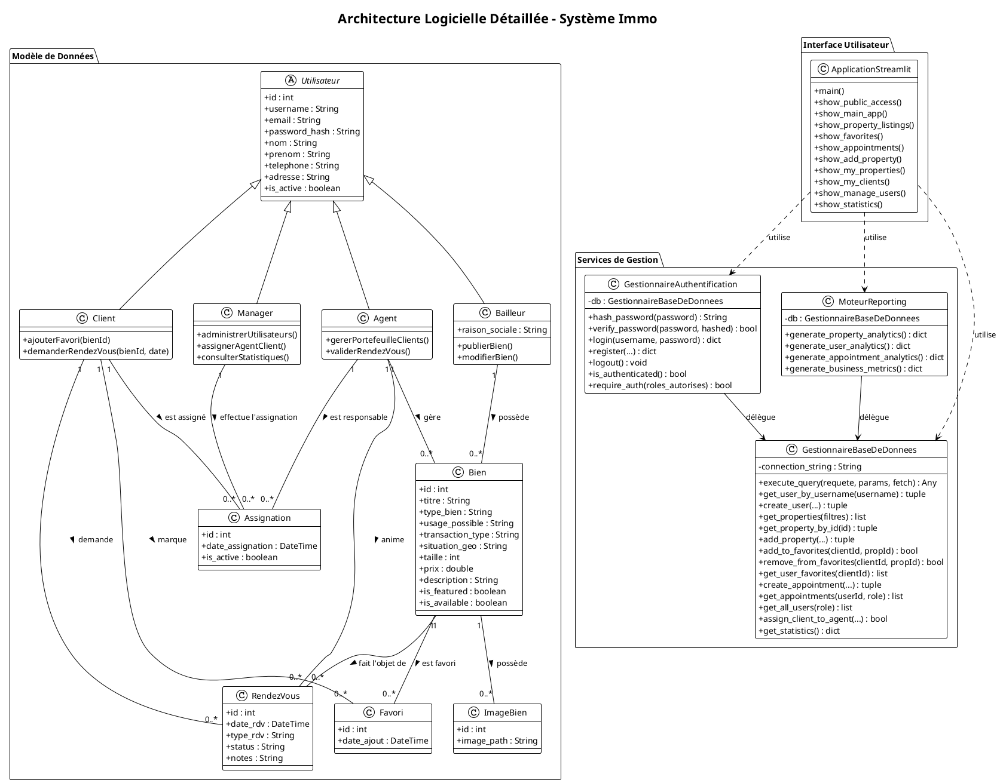
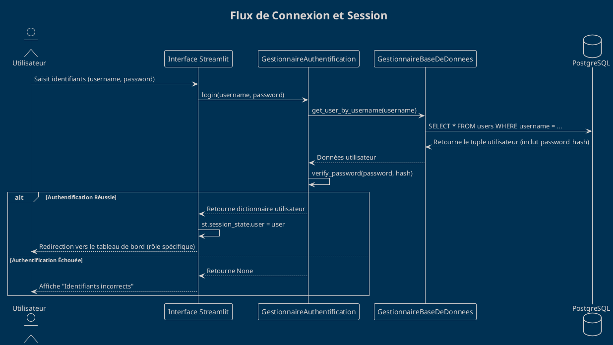
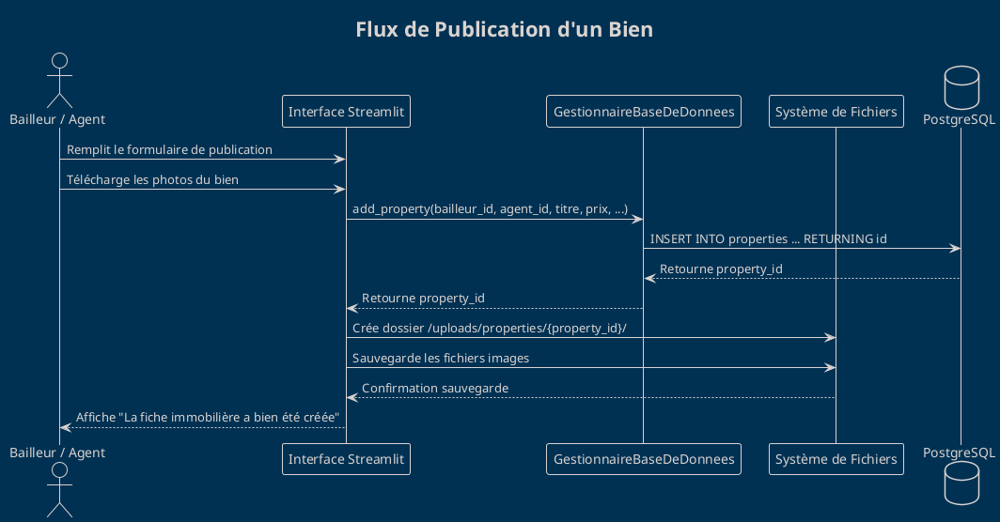
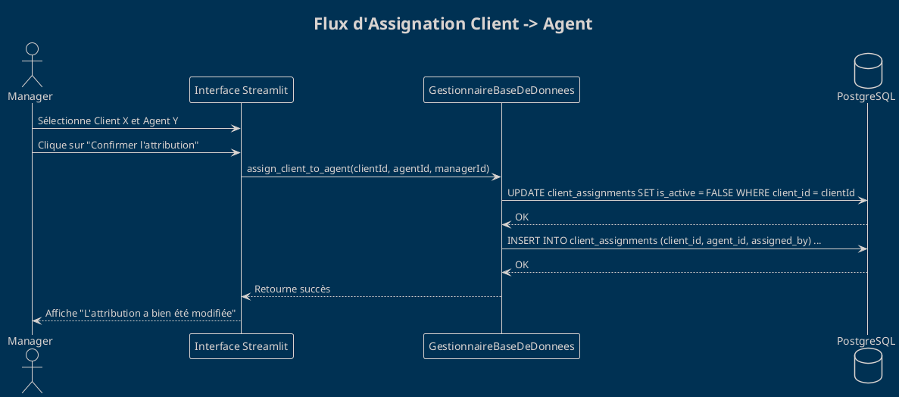
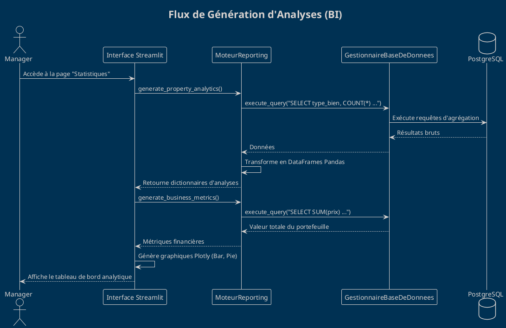
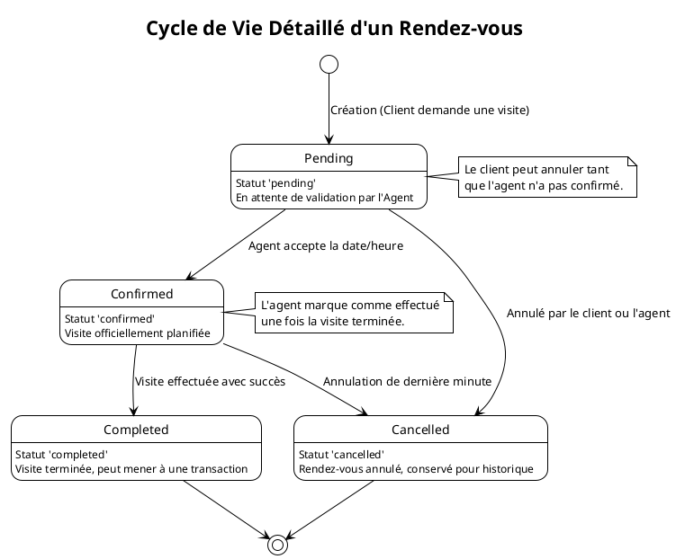
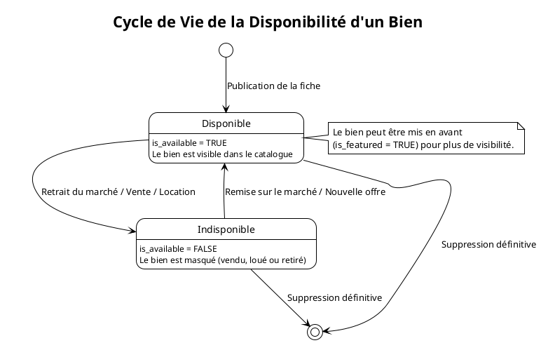
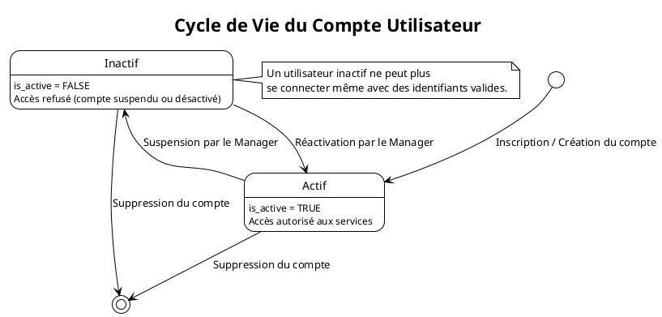

# Documentation Graphique Exhaustive du Projet Immo (PlantUML)

Ce document fournit une modélisation complète et détaillée du système, basée sur l'implémentation technique réelle. Tous les diagrammes sont conçus pour être rendus via PlantUML.

---

## 1. Diagramme Entité-Relation (ERD) Détaillé
Ce diagramme représente la structure physique et logique de la base de données PostgreSQL.

**Légende du Diagramme ERD :**
- `*` : Attribut obligatoire (NOT NULL).
- `<<PK>>` : Clé Primaire (Primary Key), identifiant unique de l'entité.
- `<<FK>>` : Clé Étrangère (Foreign Key), lien vers une clé primaire d'une autre table.
- `||--o{` : Relation "Un à Plusieurs" (1:N). Le côté `||` signifie "exactement un" et le côté `o{` signifie "zéro ou plusieurs".
- `VARCHAR/INTEGER/DECIMAL` : Types de données SQL utilisés.

---

## 2. Diagramme de Cas d'Utilisation
Ce diagramme détaille les fonctionnalités accessibles selon le rôle de l'utilisateur.

**Légende du Diagramme de Cas d'Utilisation :**
- **Bonhomme (Actor)** : Représente un rôle utilisateur externe au système.
- **Ovale (Usecase)** : Représente une fonctionnalité ou un objectif métier du système.
- **Rectangle (Package)** : Délimite le périmètre du système ("Système Immo").
- `-->` : Lien d'interaction. L'acteur déclenche le cas d'utilisation.
- `<|--` : Relation d'héritage/spécialisation. Par exemple, un "Client" hérite de toutes les capacités de l' "Utilisateur Public".

---

## 3. Diagramme de Classes (Architecture Détaillée)
Ce diagramme présente la structure complète du système : le modèle de données (entités), les services de gestion (managers) et l'interface utilisateur.

**Légende du Diagramme de Classes :**
- `+` : Membre public (accessible depuis l'extérieur de la classe).
- `-` : Membre privé (accessible uniquement à l'intérieur de la classe).
- `<|--` : Héritage. La classe fille hérite des attributs et méthodes de la classe parente.
- `--` : Association simple. Représente un lien logique entre deux classes.
- `"1" -- "0..*"` : Multiplicité. Indique qu'un élément de la classe A est lié à zéro ou plusieurs éléments de la classe B.
- `..>` : Dépendance. Indique qu'une classe utilise une autre classe temporairement (ex: appel d'une méthode).
- `-->` : Association dirigée. La classe A connaît la classe B, mais pas forcément l'inverse.

---

## 4. Diagrammes de Séquence (Flux Métier Détaillés)

### A. Authentification et Accès Sécurisé

### B. Publication d'un Bien Immobilier

### C. Assignation d'un Client à un Agent (Action Manager)

### D. Génération de Statistiques BI (Business Intelligence)

**Légende des Diagrammes de Séquence :**
- **Ligne de vie (Rectangle vertical)** : Représente la durée de vie d'un objet ou acteur pendant l'interaction.
- **Rectangle d'activation (Barre blanche sur la ligne)** : Indique que l'objet est actuellement actif et exécute une opération.
- `->` (Flèche pleine) : Message synchrone. L'émetteur attend une réponse avant de continuer.
- `-->` (Flèche pointillée) : Message de retour. Retourne le résultat d'une opération précédente.
- `alt / else` : Bloc conditionnel (équivalent à un If/Else).
- `Self-call` (Flèche revenant vers soi) : Opération interne à l'objet.

---

## 5. Diagrammes d'État (Cycles de Vie)

### A. Cycle de Vie d'un Rendez-vous
Ce diagramme détaille les transitions de statut pour les rendez-vous, conformément aux contraintes de la base de données.

### B. Cycle de Vie d'un Bien Immobilier
Ce diagramme représente la gestion de la disponibilité d'un bien sur le marché.

### C. Cycle de Vie d'un Utilisateur
Ce diagramme représente la gestion du statut d'activation d'un compte utilisateur.

**Légende des Diagrammes d'État :**
- `[*]` (Cercle plein) : Point de départ (Initial State).
- `[*]` (Cercle avec contour) : Point final (Final State).
- **Rectangle arrondi** : Un état du système.
- `-->` : Transition. Représente le changement d'un état à un autre suite à un événement.
- **Note (Rectangle jaune)** : Commentaire explicatif sur le comportement de l'état ou de la transition.
